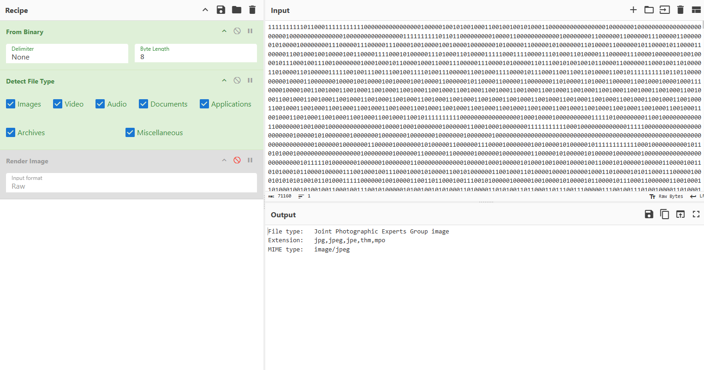
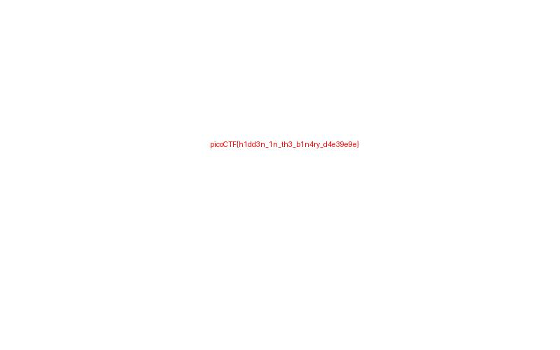

# Binary Digits

`Category: Forensics` · `Source: picoCTF` · `Difficulty: Easy`

> This file doesn't look like much... just a bunch of 1s and 0s. But maybe it's not just random
> noise. Can you recover anything meaningful from this?

---

## First look

We are given a file, `digits.bin`, the file turns out to be one
long line of nothing but `0` and `1`:

```
111111111101100011111111111000000000000000010000010010100100011001001001010001100000...
```

The whole file is 71160 of these characters with no spaces and no line breaks. From we can deduce that so this is almost certainly real data written out as raw
bits, 8 per byte. We just have to regroup the bits into bytes and see what file comes out.

---

## Decoding with CyberChef

We use CyberChef, a browser tool made exactly for this kind of conversion. Two operations are enough:

- **From Binary** turns the text `0`s and `1`s back into actual bytes.
  - **Delimiter: None**, because the bits are packed solid with nothing between them.
  - **Byte Length: 8**, because one byte is 8 bits.
- **Detect File Type** then looks at the first bytes and tells us what we rebuilt.

With that, Detect File Type gives a clear answer:



The bytes are a **JPEG image**.

---

## Getting the flag

Swapping Detect File Type for **Render Image** draws the picture, and the flag is written right
on it:



```
picoCTF{h1dd3n_1n_th3_b1n4ry_d4e39e9e}
```
