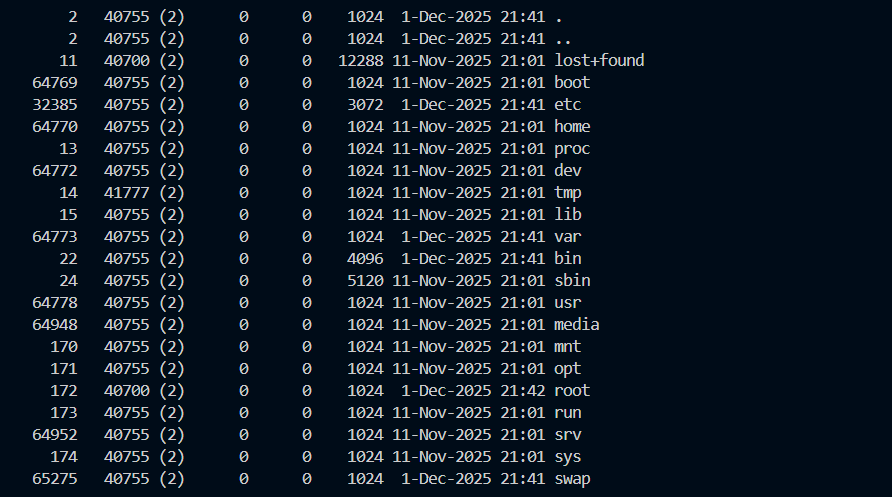
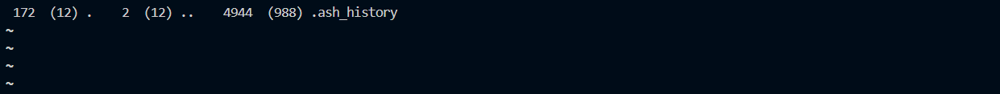
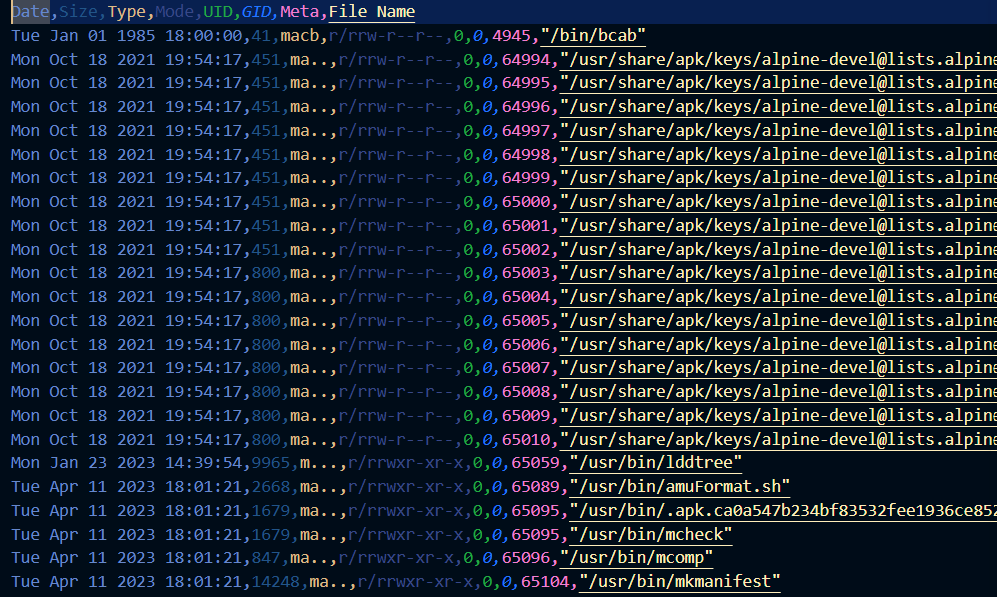

# Timeline 0

`Category: Forensics` · `Source: picoCTF` · `Difficulty: Medium`

> Can you find the flag in this disk image? Wrap what you find in the picoCTF flag format.

---

## First look

We get a file called `partition4.img.gz`, so the first
thing to do is unzip it:

```bash
gunzip partition4.img.gz
```

That leaves `partition4.img`, a 467 MB file. We check what it actually is:

```bash
file partition4.img
partition4.img: Linux rev 1.0 ext4 filesystem data ...
```

So it is a Linux disk image, an ext4 filesystem. Windows cannot open that directly, but I found out we can use `debugfs` to 
read an ext4 image without mounting it, so we can use `ls` to list a folder
inside the image and `cat` to print a file:

```bash
debugfs -R 'ls -l /' partition4.img
debugfs -R 'cat /root/.ash_history' partition4.img
```

We poke around the home folders, `/root`, the logs. The history file in
`/root` is called `.ash_history`, not `.bash_history`, so I found out it's a small Alpine system on
the `ash` shell. The history itself only contains `poweroff`, so nothing was edited or hidden through the shell. 





I also try searching the whole image for the string `picoCTF`:

```bash
strings partition4.img | grep -i picoCTF
```

Nothing comes up.

The flag is not sitting in a file we can just read and I didn't wanna go through the hundreds and hundreds of files individually.

---

## Switching strategy

I decided here to use the hints given on picoctf, The challenge is called *Timeline*, and the
hints say to build a Sleuth Kit MAC timeline, and that sloppy timestomping can leave strange, very
old timestamps. 
I learned in my Forensics class that timestomping means changing a file's timestamps to hide when it was really created or
touched. So instead of reading files, we just have to look at *when* every file was modified, and watch for an anomaly with Sleuth Kit with `fls` and `mactime` (listing and sorting timelines) :

```bash
fls -r -m "/" partition4.img > timeline.body
mactime -b timeline.body -d > timeline.csv
```
This produces a timeline.csv file we can directly read on vscode, fortunately we didn't have to search much as it was already sorted, and we can spot something odd :



`/bin/bcab`, hiding among the normal system binaries but with a date decades older than
everything around it, we assume that is our timestomped file.

---

## Reading the file

Trying to read it the normal way fails:

```bash
debugfs -R 'cat /bin/bcab' partition4.img
cat: Inode checksum does not match inode while reading inode 4945
```

I did not expect that error, but it fits once you look it up. ext4 keeps a checksum on each inode to
catch tampering, and whoever faked the timestamps edited the inode directly without recomputing it,
so ext4 now refuses to trust it. I learned that Sleuth
Kit's `icat` can read the raw structures and ignores that check, so it pulls the file out anyway using
the inode number from the timeline (4945):

```bash
icat partition4.img 4945
NzFtMzExbjNfMHU3MTEzcl9oM3JfNDNhMmU3YWYK
```

It looks like the content is base64. We decode it:

```bash
icat partition4.img 4945 | base64 -d
71m311n3_0u7113r_h3r_43a2e7af
```

---

## Getting the flag

Wrapping it in the picoCTF format the challenge asked for:

```
picoCTF{71m311n3_0u7113r_h3r_43a2e7af}
```

