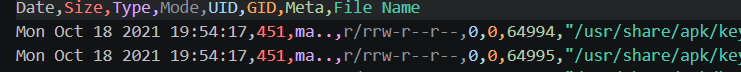
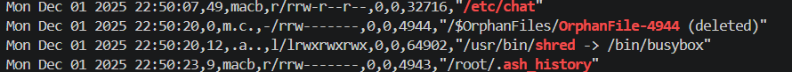
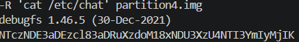
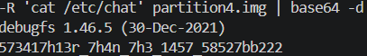

# Timeline 1

`Category: Forensics` · `Source: picoCTF` · `Difficulty: Medium`

> Can you find the flag in this disk image? Wrap what you find in the picoCTF flag format.

---

## First look

This is the sequel to Timeline 0, so I started exactly the same way. We unzip the image and check
what it is:

```bash
gunzip partition4.img.gz
file partition4.img
partition4.img: Linux rev 1.0 ext4 filesystem data ...
```

Same kind of file, a 467 MB ext4 image of a small Alpine system. We poke around with `debugfs`
again, the `/root` history, the logs, and search the whole image for the flag string:

```bash
debugfs -R 'cat /root/.ash_history' partition4.img
poweroff
strings partition4.img | grep -i picoCTF
```

`.ash_history` only contains `poweroff` again, and the string search finds nothing. So the flag is
hidden the same way as before, somewhere in the file metadata.

---

## Building the timeline

Same plan as Timeline 0. We build a Sleuth Kit MAC timeline to look at when each file was
touched:

```bash
fls -r -m "/" partition4.img > timeline.body
mactime -b timeline.body -d > timeline.csv
```

But this time it does not seem to work this way. In Timeline 0 one file had a date
decades out of place (1985), and it jumped right out. Here every single file sits in a normal recent
range, 2021 to 2025, with nothing ancient to spot:

```bash
awk -F',' 'NR>1 {split($1,a," "); print a[4]}' timeline.csv | sort | uniq -c
     17 2021
    176 2023
   2227 2024
  22144 2025
```



---

## Following the hints

picoCTF gives more hints this time: look at recent timestamps, pay attention to timestamps near an
anti-forensic action, and filter only new files by grepping for `macb`.
When all four timestamps of a file are set at the same moment, mactime prints them as `macb`, which
means the file was freshly created right then. So instead of an old file, we are looking for a new
one, created during the suspicious session.

We grep for `macb` and follow the most recent activity. The last session is easy to read: the user
installs some tools with `apk` (curl, vim), and then, in the final seconds before shutdown, three
things happen in a row:

```bash
grep -E "Dec 01 2025 22:50" timeline.csv | grep -vE "/lib/rc/cache|seedrng"
22:50:07  macb  /etc/chat
22:50:20        /usr/bin/shred ... /$OrphanFiles/OrphanFile-4944 (deleted)
22:50:23  macb  /root/.ash_history
```



That is the anti-forensic action the hint points at. The attacker runs `shred` to destroy a file
(inode 4944, now a deleted orphan), then clears the shell history down to a single `poweroff`. And a
few seconds before all that cleanup, a brand new file appears, `/etc/chat`, that is suspicious.

---

## Reading the file

Unlike Timeline 0, this file was not timestomped by editing its inode, it was just dropped in with an
innocent looking name, so reading it the normal way works fine:



It is base64 again, so we decode it:




---

## Getting the flag

Wrapping it in the picoCTF format:

```
picoCTF{573417h13r_7h4n_7h3_1457_58527bb222}
```

