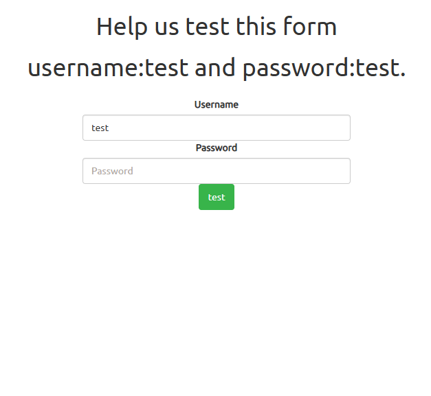
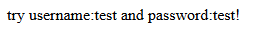
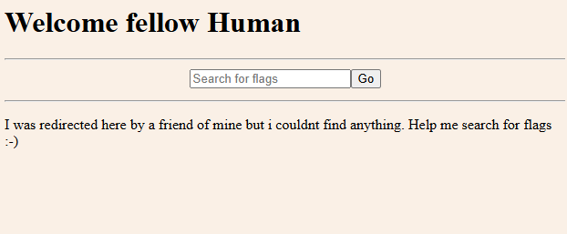
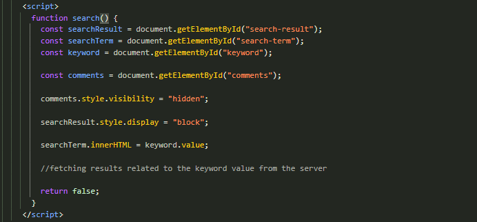
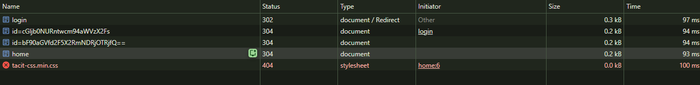
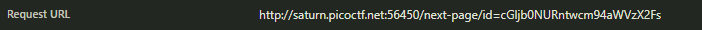
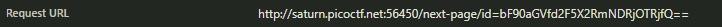

# findme

`Category: Web Exploitation` · `Source: picoCTF` · `Difficulty: Medium`

> Help us test the form by submitting the username as test and password as test!

---

## First look

The site is a single login form, "Help us test this form", asking for username `test` and
password `test`.



Logging in with `test` / `test`
just bounces back the line `try username:test and password:test!` and goes nowhere.



With `test` / `test!` the login goes through, and I land on a page that says "Welcome fellow
Human" with a search box.



The search box does nothing useful. Looking at the source in F12 -> Sources confirms it:



The `search()` function just writes whatever you typed back onto the page (`innerHTML = keyword.value`), nothing ever contacts the server.

---

## Watching the redirects

The jump from the login to that page happens too fast to read in the address bar. So I opened
the browser dev tools (F12), went to the **Network** tab, turned on **Preserve log** so the
entries survive each redirect, and logged in again.



We can see that the `login` request answers with a `302` redirect, then the
browser is sent through two requests with strange `id=...` names, and only then does it reach
`home`. So logging in redirects me through two intermediate addresses before dropping me on
the "fake" home page.

---

## The two redirects

Opening each of those two requests and reading their address shows this:





```
/next-page/id=cGljb0NURntwcm94aWVzX2Fs
/next-page/id=bF90aGVfd2F5X2RmNDRjOTRjfQ==
```

We can directly assume that those `id=` values are not random, they are encoded in **base64**. Put together, those two pieces
should be the flag. Decoding both with base64:

```
cGljb0NURntwcm94aWVzX2Fs       ->  picoCTF{proxies_al
bF90aGVfd2F5X2RmNDRjOTRjfQ==   ->  l_the_way_df44c94c}
```

The first piece already starts with `picoCTF{`, which confirms the idea: each redirect carried
one half of the flag.

---

## Getting the flag

Joining the two halves:

```
picoCTF{proxies_all_the_way_df44c94c}
```
So the challenge was named findme because the flag was not on a page but on the addresses of the redirects.
